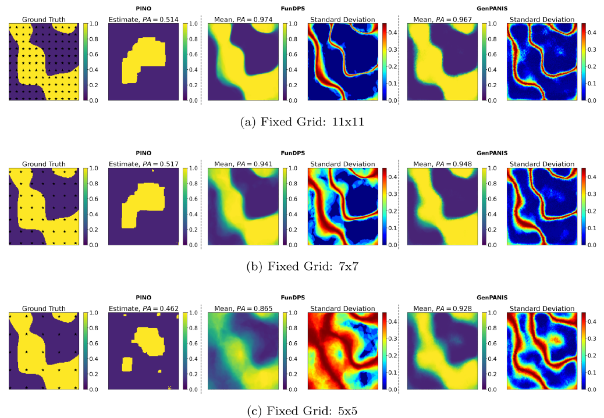

# GenPANIS: A latent-variable generative framework for forward and inverse PDE problems in multiphase media

> M. Chatzopoulos and P.-S. Koutsourelakis, *GenPANIS: A latent-variable generative framework for forward and inverse PDE problems in multiphase media*, **Journal of Computational Physics** 564 (2026) 115140.
> [https://doi.org/10.1016/j.jcp.2026.115140](https://doi.org/10.1016/j.jcp.2026.115140)

---

## Visuals



## Description
**Abstract**

Inverse problems and inverse design in multiphase media, i.e., recovering or engineering microstructures to achieve target macroscopic responses, require operating on discrete-valued material fields, rendering the problem non-differentiable and incompatible with gradient-based methods. Existing approaches either relax to continuous approximations, compromising physical fidelity, or employ separate heavyweight models for forward and inverse tasks. We propose GenPANIS, a unified generative framework that preserves exact discrete microstructures while enabling gradient-based inference through continuous latent embeddings. The model learns a joint distribution over microstructures and PDE solutions, supporting bidirectional inference (forward prediction and inverse recovery) within a single architecture. The generative formulation enables training with unlabeled data, physics residuals, and minimal labeled pairs. A physics-aware decoder incorporating a differentiable coarse-grained PDE solver preserves governing equation structure, enabling extrapolation to varying boundary conditions and microstructural statistics. A learnable normalizing flow prior captures complex posterior structure for inverse problems. Demonstrated on Darcy flow and Helmholtz equations, GenPANIS maintains accuracy on challenging extrapolative scenarios—including unseen boundary conditions, volume fractions, and microstructural morphologies, with sparse, noisy observations. It outperforms state-of-the-art methods while using 10–100 times fewer parameters and providing principled uncertainty quantification.

**Summary**

GenPANIS is a unified generative framework that jointly models microstructures and PDE solutions in multiphase media. By learning a joint distribution over a latent microstructure embedding and a PDE solution field, the model enables **bidirectional inference in a single architecture**:

- **Forward problem**: given a microstructure, predict the PDE solution distribution.
- **Inverse problem**: given (partial/sparse) PDE observations, infer the microstructure posterior.

Key design choices:
- **Physics-aware decoder** — a differentiable coarse-grained finite-element solver enforces the governing PDE at training time, so no labeled solution data are required for training.
- **Normalizing flow prior** (RealNVP) — exact log-likelihood on the latent space enables gradient-based posterior inference via Hamiltonian Monte Carlo (HMC).
- **Continuous latent embedding** — discrete binary microstructures are embedded in a smooth latent space, preserving their exact geometry while allowing gradient flow.

Demonstrated on 2-D **Darcy flow** and **Helmholtz equation** in two-phase media. Compared against PINO and FunDPS:

| Model | Parameters | Training time |
|-------|-----------|---------------|
| **GenPANIS** | **2.9 M** | **~0.6 h** |
| PINO | 13.1 M | ~38 h |
| FunDPS | 183.3 M | ~45 h |

## Badges

[](https://doi.org/10.1016/j.jcp.2026.115140)
[](LICENSE)


## Installation

**The only requirement is [Docker](https://docs.docker.com/get-docker/).** Pull the pre-built image:

```bash
docker pull mattchatz/fenics
```

Then clone this repository and launch a container with the repo mounted:

```bash
git clone https://github.com/pkmtum/GenPANIS.git
cd GenPANIS
docker run --rm -it --gpus all -v "$(pwd)":/workspace mattchatz/fenics
```

All dependencies (FEniCS, PyTorch, and everything else required) are already included in the image. No conda setup or manual package installation is needed.

## Data

The large data files (training datasets, reference MCMC samples, etc) are hosted on Zenodo:

> **[https://zenodo.org/records/21068584](https://zenodo.org/records/21068584)**

Download `genpanisData.tar` from that page and place it in the repository root. Then run:

```bash
bash decompress_data.sh
```

This extracts and decompresses all files to their correct locations. The repository is then in a **ready-to-run** state — inference and training will all work out of the box.

## Usage

### Pretrained checkpoints

Pretrained checkpoints are included in the repository and are ready to use out of the box:

- `checkpoints/darcy10k_pretrained.ckpt` — Darcy flow model
- `checkpoints/helmholz10k_pretrained.ckpt` — Helmholtz equation model

You can go straight to inference without training anything.

### 1. Run inference

All inference scripts **automatically discover the most recently trained checkpoint** for their PDE type — no path configuration needed.

Two bash scripts cover the full experiment suite:

```bash
bash experiments/demo/run_darcy.sh    --num_samples <N> --burn <B>
bash experiments/demo/run_helmholz.sh --num_samples <N> --burn <B>
```

Or run the full suite (Darcy + Helmholtz) in one go with `test_run.sh`:

```bash
bash experiments/demo/test_run.sh --num_samples <N> --burn <B>
```

**Quick sanity check** — fast run to verify the pipeline end-to-end:

```bash
bash experiments/demo/test_run.sh --num_samples 200 --burn 100
```

**Full run** — use enough samples for HMC convergence:

```bash
bash experiments/demo/test_run.sh --num_samples 15000 --burn 10000
```

Optionally save figures to a custom directory (avoids overwriting previous results):

```bash
bash experiments/demo/test_run.sh \
    --num_samples 15000 --burn 10000 --figs_dir experiments/demo/figs_v2
```

All output plots are saved to `experiments/demo/figs/` by default, with unique filenames per experiment (e.g. `resInverse_partialObs_11x11.png`).

Individual scripts can also be run directly. They auto-discover the checkpoint, but you can override it:

```bash
# Auto-discover latest darcy checkpoint
python3 experiments/demo/outVf.py --num_samples 15000 --burn 10000

# Or point to a specific checkpoint
python3 experiments/demo/outVf.py \
    --checkpoint checkpoints/darcy10k_pretrained.ckpt \
    --num_samples 15000 --burn 10000
```

### 2. Retrain (optional)

If you want to train your own models from scratch, two training scripts are provided:

```bash
# Darcy flow
python experiments/demo/train_darcy.py

# Helmholtz equation
python experiments/demo/train_helmholz.py
```

New checkpoints are saved under `checkpoints/genPANIS_darcy_10000/` and `checkpoints/genPANIS_helmholz_10000/` respectively. The inference scripts automatically pick up the most recently saved checkpoint, so re-running inference after training will use the new weights.

#### Mixed-data training (labeled + unlabeled + virtual observables)

[`experiments/demo/train_darcy_mixed.py`](experiments/demo/train_darcy_mixed.py) demonstrates training on a mixture of three data regimes simultaneously:

| Split | Samples | What the model sees |
|-------|---------|---------------------|
| Labeled | 3 000 | Microstructure + PDE solution — full supervision |
| Unlabeled | 3 000 | Microstructure only — VAE prior + reconstruction, no physics |
| Virtual observables (VO) | 3 000 | Microstructure only — physics residual enforced via the differentiable FE solver, no solution labels |

```bash
python experiments/demo/train_darcy_mixed.py --epochs 500
```

Checkpoints are saved under `checkpoints/genPANIS_darcy_3k_mixed/`.

> **Note on training speed.** Expect the mixed run to be noticeably slower per epoch than the labeled-only baseline. The bottleneck is the VO term: for every VO batch the model must evaluate the PDE residual by numerically integrating the terms of the weighted residuals.


## Authors and acknowledgment

- Matthaios Chatzopoulos (TU Munich)
- Phaedon-Stelios Koutsourelakis (TU Munich)

If you use this code, please cite:

```bibtex
@article{chatzopoulos2026genpanis,
  title={GenPANIS: A Latent-Variable Generative Framework for Forward and Inverse PDE Problems in Multiphase Media},
  author={Chatzopoulos, Matthaios and Koutsourelakis, Phaedon-Stelios},
  journal={Journal of Computational Physics},
  pages={115140},
  year={2026},
  publisher={Elsevier}
}
```

## License

MIT
